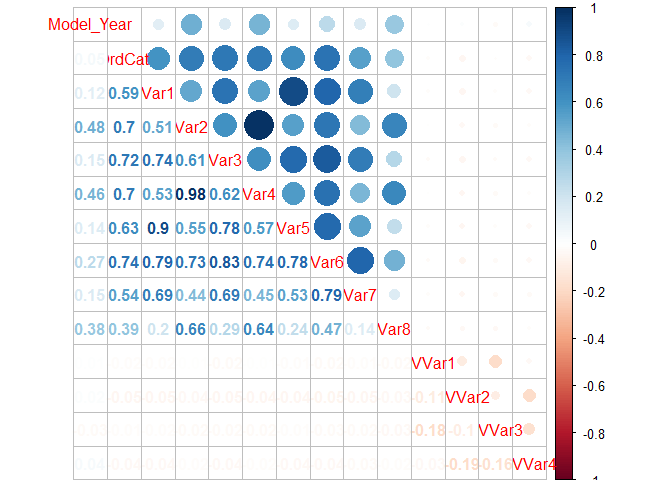

CORRELACIÓN ENTRE VARIABLES CONTINUAS
-------------------------------------

Visualizamos la relación entre la variable dependiente "Claim\_Amount" y
las diferentes variables continuas.

### Carga del fichero

    train <- read.csv("traindf.csv")
    str(train)

    ## 'data.frame':    689754 obs. of  26 variables:
    ##  $ Blind_Submodel: Factor w/ 2721 levels "A.2.0","A.3.0",..: 1 1 1 1 1 1 2 3 4 4 ...
    ##  $ Model_Year    : int  1990 1990 1990 1990 1990 1991 1981 1981 1981 1981 ...
    ##  $ Cat1          : Factor w/ 10 levels "A","B","C","D",..: 5 5 5 5 5 5 5 1 1 1 ...
    ##  $ Cat2          : Factor w/ 3 levels "A","B","C": 2 2 2 2 2 2 2 2 2 2 ...
    ##  $ Cat3          : Factor w/ 6 levels "A","B","C","D",..: 4 4 4 4 4 4 3 3 3 3 ...
    ##  $ Cat4          : Factor w/ 3 levels "A","B","C": 1 1 1 1 1 1 1 3 3 3 ...
    ##  $ Cat5          : Factor w/ 3 levels "A","B","C": 1 1 1 1 1 1 1 2 2 2 ...
    ##  $ Cat6          : Factor w/ 5 levels "B","C","D","E",..: 2 2 2 2 2 2 1 2 2 2 ...
    ##  $ Cat7          : Factor w/ 4 levels "A","B","C","D": 1 1 1 1 1 1 1 2 2 2 ...
    ##  $ Cat8          : Factor w/ 3 levels "A","B","C": 1 1 1 1 1 1 1 1 1 1 ...
    ##  $ Cat9          : Factor w/ 2 levels "A","B": 2 2 2 2 2 2 2 2 2 2 ...
    ##  $ OrdCat        : int  2 2 2 2 2 2 2 2 2 2 ...
    ##  $ Var1          : num  -0.553 -0.553 -0.553 -0.553 -0.553 ...
    ##  $ Var2          : num  -1.33 -1.33 -1.33 -1.33 -1.33 ...
    ##  $ Var3          : num  -1.05 -1.05 -1.05 -1.05 -1.05 ...
    ##  $ Var4          : num  -1.37 -1.37 -1.37 -1.37 -1.37 ...
    ##  $ Var5          : num  -0.954 -0.954 -0.954 -0.954 -0.954 ...
    ##  $ Var6          : num  -1.11 -1.11 -1.11 -1.11 -1.11 ...
    ##  $ Var7          : num  -0.825 -0.825 -0.825 -0.825 -0.825 ...
    ##  $ Var8          : num  -0.641 -0.641 -0.641 -0.641 -0.641 ...
    ##  $ NVCat         : Factor w/ 15 levels "A","B","C","D",..: 5 13 14 10 15 15 5 13 15 13 ...
    ##  $ NVVar1        : num  -0.232 -0.232 -0.232 -0.232 -0.232 ...
    ##  $ NVVar2        : num  -0.266 -0.266 2.784 4.308 -0.266 ...
    ##  $ NVVar3        : num  -0.272 -0.272 -0.272 -0.272 -0.272 ...
    ##  $ NVVar4        : num  -0.251 -0.251 -0.251 -0.251 -0.251 ...
    ##  $ Claim_Amount  : num  0 0 0 0 0 0 0 0 0 0 ...

### Correlación entre todas las variables Continuas

Selección de variables continuas:

    library(corrplot)
    cols <- c("Model_Year","OrdCat","Var1","Var2","Var3","Var4","Var5","Var6","Var7","Var8","NVVar1","NVVar2","NVVar3","NVVar4")
    train_cor <- train[,cols]

Plot Correlación entre variables:

    M <- cor(train_cor)
    corrplot.mixed(M)

Los colores oscuros representan mayor correlación, como podemos
comprobar hay variables numéricas altamente correlacionadas entre ellas.

### Correlaciones Individuales

### Variables continuas - Características del vehículo

La correlacción entre Claim\_Amount y Model\_year7

    cor( train$Model_Year,train$Claim_Amount)

    ## [1] 0.02749687

    plot(train$Model_Year,train$Claim_Amount)

La correlacción entre Claim\_Amount y OrdCat

    cor(train$OrdCat,train$Claim_Amount)

    ## [1] -0.005075587

    plot(train$OrdCat,train$Claim_Amount)

La correlacción entre Claim\_Amount y Var1

    cor(train$Var1,train$Claim_Amount)

    ## [1] -0.003562823

    plot(train$Var1,train$Claim_Amount)

La correlacción entre Claim\_Amount y Var2

    cor(train$Var2,train$Claim_Amount)

    ## [1] 0.001345127

    plot(train$Var2,train$Claim_Amount)

La correlacción entre Claim\_Amount y Var3

    cor(train$Var3,train$Claim_Amount)

    ## [1] 0.001458461

    plot(train$Var3,train$Claim_Amount)

La correlacción entre Claim\_Amount y Var4

    cor(train$Var4,train$Claim_Amount)

    ## [1] 0.001318163

    plot(train$Var4,train$Claim_Amount)

La correlacción entre Claim\_Amount y Var5

    cor(train$Var5,train$Claim_Amount)

    ## [1] 0.004564181

    plot(train$Var5,train$Claim_Amount)

La correlacción entre Claim\_Amount y Var6

    cor(train$Var6,train$Claim_Amount)

    ## [1] -0.001585308

    plot(train$Var6,train$Claim_Amount)

La correlacción entre Claim\_Amount y Var7

    cor(train$Var7,train$Claim_Amount)

    ## [1] -0.002641458

    plot(train$Var7,train$Claim_Amount)

La correlacción entre Claim\_Amount y Var8

    cor(train$Var8,train$Claim_Amount)

    ## [1] 0.0005885435

    plot(train$Var8,train$Claim_Amount)

### Variables continuas- Características de la póliza

La correlacción entre Claim\_Amount y NVVar1

    cor(train$NVVar1,train$Claim_Amount)

    ## [1] -0.0436794

    plot(train$NVVar1,train$Claim_Amount)

La correlacción entre Claim\_Amount y NVVar2

    cor(train$NVVar2,train$Claim_Amount)

    ## [1] -0.04536111

    plot(train$NVVar2,train$Claim_Amount)

La correlacción entre Claim\_Amount y NVVar3

    cor(train$NVVar3,train$Claim_Amount)

    ## [1] -0.04356654

    plot(train$NVVar3,train$Claim_Amount)

La correlacción entre Claim\_Amount y NVVar4

    cor(train$NVVar4,train$Claim_Amount)

    ## [1] -0.03900727

    plot(train$NVVar4,train$Claim_Amount)

### Correlación entre todas las variables Categóricas

    library(polycor)
    pruebahetcor <- train[,c("Cat1","Cat2","Cat3","Cat4","Cat5","Cat6","Cat7","Cat8","Cat9")]
    corrcategorical <- hetcor(pruebahetcor)
    corcategorical <- as.matrix(corrcategorical$correlations)
    corrplot.mixed(corcategorical)

### Distribución Variables Categóricas

    par(mfrow=c(3,3),oma=c(0,0,2,0))
    plot(train$Cat1,main="Distribución Cat1")
    plot(train$Cat2,main="Distribución Cat2")
    plot(train$Cat3,main="Distribución Cat3")
    plot(train$Cat4,main="Distribución Cat4")
    plot(train$Cat5,main="Distribución Cat5")
    plot(train$Cat6,main="Distribución Cat6")
    plot(train$Cat7,main="Distribución Cat7")
    plot(train$Cat8,main="Distribución Cat8")
    plot(train$Cat9,main="Distribución Cat9")
    mtext('DISTRIBUCIÓN VARIABLES CATEGÓRICAS', outer = TRUE, cex = 1.5)

### Distribución de la Variable Dependiente

Observaciones con importe diferente de 0:

    positive <- train[train$Claim_Amount!=0,]
    hist(positive$Claim_Amount,main="Histograma Claim Amount")

Aplicando Transformación logarítmica:

    hist(log(positive$Claim_Amount+1),main="Histograma Log Claim Amount")

Los resultados que hemos obtenido en nuestros modelos se han ajustado
mejor cuando hemos aplicado el logaritmo sobre la variable dependiente.
