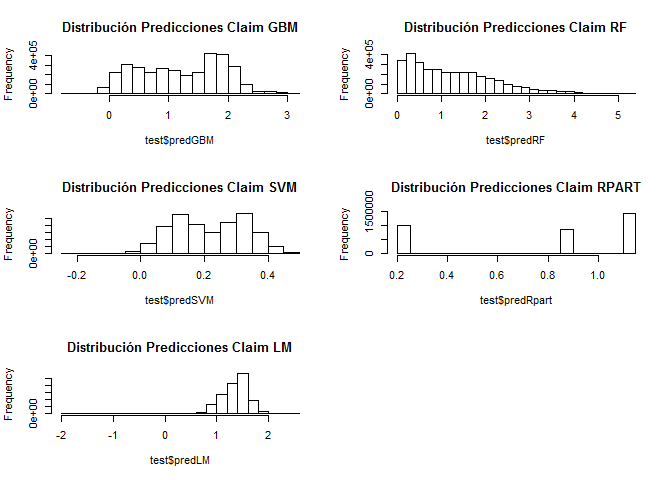
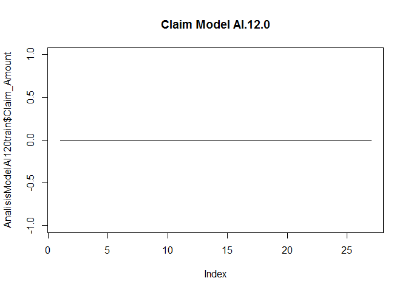

VISUALIZACIÓN RESULTADOS DE LA PREDICCIÓN
-----------------------------------------

La visualización debido al tamaño del fichero test no lo hemos podido
visualizar en Shiny.

### Carga de Fichero Test

A lo largo de la ejecución de los diferentes modelos y su
correspondiente predicción para las observaciones del fichero Test,
hemos ido añadiendo los resultados que nos han ido proporcionando como
una nueva variable dentro del fichero.

    test <- read.csv("testdf.csv")
    head(test)

    ##     Row_ID Household_ID Vehicle Calendar_Year Model_Year Blind_Submodel
    ## 1  8174488      5216592       2          2006       1990          A.2.0
    ## 2 13040175      7446081       4          2005       1982         AB.2.0
    ## 3   505984       303295       1          2005       1999         AC.1.1
    ## 4  7147295      4684026       2          2007       1999         AC.1.1
    ## 5   423374       277429       1          2005       1999         AC.1.1
    ## 6  4372396      2673885       1          2007       1999         AC.1.1
    ##   Cat1 Cat2 Cat3 Cat4 Cat5 Cat6 Cat7 Cat8 Cat9 OrdCat       Var1      Var2
    ## 1    E    B    D    A    A    C    A    A    B      2 -0.5534074 -1.334886
    ## 2    A    B    C    C    B    C    B    A    B      2 -1.5658145 -1.386760
    ## 3    F    A    A    B    A    F    C    A    B      2 -1.0274711 -1.421342
    ## 4    F    A    A    B    A    F    C    A    B      2 -1.0274711 -1.421342
    ## 5    F    A    A    B    A    F    C    A    B      2 -1.0274711 -1.421342
    ## 6    F    A    A    B    A    F    C    A    B      2 -1.0274711 -1.421342
    ##         Var3      Var4       Var5       Var6     Var7       Var8 NVCat
    ## 1 -1.0548100 -1.374998 -0.9536453 -1.1133698 -0.82476 -0.6413755     O
    ## 2 -0.9391084 -1.425739 -1.5780954 -0.9788531 -1.59888 -0.4379033     N
    ## 3 -1.4019151 -1.459567 -1.8278754 -1.5379746 -0.82476 -1.1902038     O
    ## 4 -1.4019151 -1.459567 -1.8278754 -1.5379746 -0.82476 -1.1902038     F
    ## 5 -1.4019151 -1.459567 -1.8278754 -1.5379746 -0.82476 -1.1902038     M
    ## 6 -1.4019151 -1.459567 -1.8278754 -1.5379746 -0.82476 -1.1902038     F
    ##       NVVar1     NVVar2     NVVar3     NVVar4 Claim_Amount   predGBM
    ## 1 -0.2315299 -0.2661168 -0.2723372 -0.2514189            0 1.3175081
    ## 2 -0.2315299  2.7836161 -0.2723372 -0.2514189            0 0.3135392
    ## 3 -0.2315299 -0.2661168 -0.2723372 -0.2514189            0 1.1729277
    ## 4 -0.2315299 -0.2661168 -0.2723372 -0.2514189            0 0.3594719
    ## 5 -0.2315299 -0.2661168 -0.2723372 -0.2514189            0 1.7524298
    ## 6 -0.2315299 -0.2661168 -0.2723372 -0.2514189            0 0.3594719
    ##      predRF    predSVM predRpart   predLM clasification classGLM
    ## 1 0.9679057 0.15523373 0.8772591 0.989047             0        0
    ## 2 0.6303059 0.04774093 0.2040675 1.347731             0        0
    ## 3 1.2185554 0.37068739 0.8772591 1.353282             0        1
    ## 4 0.4918692 0.16244496 0.2040675 1.339038             0        0
    ## 5 1.3790246 0.29784024 1.1021465 1.352045             0        0
    ## 6 0.4918692 0.16244496 0.2040675 1.339038             0        0
    ##      ProbGLM classRF prob0RF prob1RF
    ## 1 0.14729298       1   0.334   0.666
    ## 2 0.02091045       0   0.836   0.164
    ## 3 0.50698484       1   0.040   0.960
    ## 4 0.11003005       1   0.338   0.662
    ## 5 0.46420743       1   0.028   0.972
    ## 6 0.11003005       1   0.338   0.662

Selección de columnas para nuestro fichero final

    cols <- c("Row_ID", "Household_ID", "Vehicle", "Calendar_Year", "Model_Year","Blind_Submodel" ,"Claim_Amount", "predGBM", "predRF", "predSVM", "predRpart", "predLM", "clasification", "classGLM", "ProbGLM", "classRF", "prob0RF", "prob1RF")
    ResultadosFinal <- test[,cols]

Ordenamos por los Siniestros reales más elevados:

    head(ResultadosFinal[order(-ResultadosFinal$Claim_Amount),],10)

    ##           Row_ID Household_ID Vehicle Calendar_Year Model_Year
    ## 91708    8928713      5933598       2          2006       1985
    ## 1683803  1630682       929057       2          2006       2002
    ## 1276900 11590783      6843381       1          2006       2005
    ## 484922   7815279      4977383       1          2005       2003
    ## 1940387  4963885      3125515       1          2006       1992
    ## 3220683 11972461      6988693       3          2006       1994
    ## 1993831  8965335      5946298       1          2005       1997
    ## 2908770  8455422      5502042       2          2006       2005
    ## 2526072 12403029      7133690       3          2007       2006
    ## 1582429 12000284      6998071       1          2006       2002
    ##         Blind_Submodel Claim_Amount    predGBM    predRF    predSVM
    ## 91708          AI.12.0    11310.660 0.97711327 0.5534033 0.10345570
    ## 1683803       BW.167.0     9275.612 2.15430000 1.9618320 0.32696480
    ## 1276900        BO.38.1     8442.933 1.68237100 2.2563480 0.36445430
    ## 484922         AJ.77.2     8204.004 1.55734500 0.6916283 0.17545650
    ## 1940387         I.16.1     7347.086 0.02091783 0.2243550 0.04902872
    ## 3220683          Y.4.0     6729.336 0.67678110 0.8126167 0.18744830
    ## 1993831          K.2.2     6540.792 1.61536300 1.9784620 0.34568850
    ## 2908770         X.24.9     6374.290 2.10563500 1.5658600 0.27684710
    ## 2526072         N.10.1     6276.016 2.15105700 2.4036520 0.25298560
    ## 1582429       BW.115.0     6077.610 2.34602500 1.3968270 0.28503270
    ##         predRpart   predLM clasification classGLM    ProbGLM classRF
    ## 91708   1.1021465 1.046731             1        0 0.12403894       1
    ## 1683803 1.1021470 1.229423             1        0 0.44277060       1
    ## 1276900 1.1021470 1.321324             1        1 0.56629300       1
    ## 484922  1.1021470 1.427782             1        0 0.34545450       1
    ## 1940387 0.2040675 1.418600             1        0 0.08364066       0
    ## 3220683 0.8772591 1.611680             1        0 0.44056050       1
    ## 1993831 1.1021470 1.491745             1        1 0.68667320       1
    ## 2908770 1.1021470 1.398067             1        1 0.51973540       1
    ## 2526072 1.1021470 1.077296             1        0 0.33848450       1
    ## 1582429 1.1021470 1.251875             1        1 0.51604780       1
    ##         prob0RF prob1RF
    ## 91708     0.340   0.660
    ## 1683803   0.036   0.964
    ## 1276900   0.004   0.996
    ## 484922    0.024   0.976
    ## 1940387   0.654   0.346
    ## 3220683   0.448   0.552
    ## 1993831   0.000   1.000
    ## 2908770   0.040   0.960
    ## 2526072   0.086   0.914
    ## 1582429   0.000   1.000

En el caso de los que tienen una indemnización elevada vemos que el
error es elevado, los modelos no predicen bien. De la misma manera
cuando analizamos los modelos de clasificación, aunque apliquemos
técnicas de calibración de las probabilidades la clasificación sigue
siendo mala, y al aproximarnos al 100% de probabilidad como corte para
ser lo más exigentes posible y buscar los casos en los que la
probabilidad es cercana al 100% para considerarlos con daño corporal.

Ordenando nuestra base de datos tanto ascendente como descendente según
el importe del Claim Amount nos damos cuenta de que al igual que el
modelo de Regresión en de Clasificación no consigue buenos resultados.

### DISTRIBUCIÓN VARIABLE DEPENDIENTE CLAIM AMOUNT

Como sucedía con nuestro dataset train, la distribución aplicando
transformación sobre la variable dependiente nos aporta mejores
resultados en cuanto a R-squared y RSME.

    par(mfrow=c(2,1))
    hist(test$Claim_Amount)
    hist(log(test$Claim_Amount)+1)

### DISTRIBUCIÓN PREDICCIONES DIFERENTES MODELOS

Los importes predichos por los diferentes modelos tienen las siguientes
distribuciones

    par(mfrow=c(3,2))
    hist(test$predGBM,main="Distribución Predicciones Claim GBM")
    hist(test$predRF,main="Distribución Predicciones Claim RF")
    hist(test$predSVM,main="Distribución Predicciones Claim SVM")
    hist(test$predRpart,main="Distribución Predicciones Claim RPART")
    hist(test$predLM,main="Distribución Predicciones Claim LM")

### CÁLCULO RSME PARA CADA OBSERVACIÓN

    ResultadosFinal$ErrorGBM <- (ResultadosFinal$Claim_Amount-ResultadosFinal$predGBM)^2
    ResultadosFinal$ErrorRF <- (ResultadosFinal$Claim_Amount-ResultadosFinal$predRF)^2
    ResultadosFinal$ErrorSVM <- (ResultadosFinal$Claim_Amount-ResultadosFinal$predSVM)^2
    ResultadosFinal$ErrorRpart <- (ResultadosFinal$Claim_Amount-ResultadosFinal$predRpart)^2
    ResultadosFinal$ErrorLM <- (ResultadosFinal$Claim_Amount-ResultadosFinal$predLM)^2

Mean absolute Error

    library(reshape2)
    error <- ResultadosFinal[,c("ErrorGBM","ErrorRF","ErrorSVM","ErrorRpart","ErrorLM")]
    MAE <- sapply(error,mean)
    MAE

    ##   ErrorGBM    ErrorRF   ErrorSVM ErrorRpart    ErrorLM 
    ##   1548.417   1548.765   1549.204   1548.425   1547.795

Root Mean Square Error

    RMSE <- melt(sapply(MAE,sqrt))
    RMSE

    ##               value
    ## ErrorGBM   39.34993
    ## ErrorRF    39.35435
    ## ErrorSVM   39.35993
    ## ErrorRpart 39.35003
    ## ErrorLM    39.34202

### VISUALIZACIóN RESULTADO PARA UN MODELO EN CONCRETO

Escogemos el modelo con mayor indemnización por daño corporal Modelo
"AI.12.0" de 1985.

    AnalisisModelAI120 <- test[test$Blind_Submodel=="AI.12.0"&test$Model_Year==1985,]
    dim(AnalisisModelAI120)

    ## [1] 53 41

    head(AnalisisModelAI120[order(-AnalisisModelAI120$Claim_Amount),])

    ##         Row_ID Household_ID Vehicle Calendar_Year Model_Year
    ## 91708  8928713      5933598       2          2006       1985
    ## 91679 12406592      7134834       2          2007       1985
    ## 91680 11240478      6724755       1          2006       1985
    ## 91681  6078729      4082881       1          2006       1985
    ## 91682  2090387      1247169       3          2007       1985
    ## 91683  5844907      4002525       1          2007       1985
    ##       Blind_Submodel Cat1 Cat2 Cat3 Cat4 Cat5 Cat6 Cat7 Cat8 Cat9 OrdCat
    ## 91708        AI.12.0    A    B    C    C    A    D    D    A    B      5
    ## 91679        AI.12.0    A    B    C    C    A    D    D    A    B      5
    ## 91680        AI.12.0    A    B    C    C    A    D    D    A    B      5
    ## 91681        AI.12.0    A    B    C    C    A    D    D    A    B      5
    ## 91682        AI.12.0    A    B    C    C    A    D    D    A    B      5
    ## 91683        AI.12.0    A    B    C    C    A    D    D    A    B      5
    ##             Var1       Var2       Var3       Var4      Var5       Var6
    ## 91708 -0.0954137 -0.9026076 -0.0829161 -0.9521559 0.2298362 -0.2817058
    ## 91679 -0.0954137 -0.9026076 -0.0829161 -0.9521559 0.2298362 -0.2817058
    ## 91680 -0.0954137 -0.9026076 -0.0829161 -0.9521559 0.2298362 -0.2817058
    ## 91681 -0.0954137 -0.9026076 -0.0829161 -0.9521559 0.2298362 -0.2817058
    ## 91682 -0.0954137 -0.9026076 -0.0829161 -0.9521559 0.2298362 -0.2817058
    ## 91683 -0.0954137 -0.9026076 -0.0829161 -0.9521559 0.2298362 -0.2817058
    ##             Var7       Var8 NVCat     NVVar1     NVVar2     NVVar3
    ## 91708 -0.9476362 -0.4423884     M -0.2315299 -0.2661168 -0.2723372
    ## 91679 -0.9476362 -0.4423884     M  3.1977900 -0.2661168 -0.2723372
    ## 91680 -0.9476362 -0.4423884     O -0.2315299 -0.2661168 -0.2723372
    ## 91681 -0.9476362 -0.4423884     N -0.2315299  2.7836160 -0.2723372
    ## 91682 -0.9476362 -0.4423884     L -0.2315299 -0.2661168 -0.2723372
    ## 91683 -0.9476362 -0.4423884     K -0.2315299 -0.2661168 -0.2723372
    ##           NVVar4 Claim_Amount    predGBM     predRF     predSVM predRpart
    ## 91708 -0.2514189     11310.66 0.97711327 0.55340330 0.103455700 1.1021465
    ## 91679  3.0686920         0.00 0.08043511 0.20521600 0.086338030 1.1021465
    ## 91680 -0.2514189         0.00 0.89174864 0.33413690 0.098944500 0.8772591
    ## 91681 -0.2514189         0.00 0.37163243 0.13782090 0.125078500 0.2040675
    ## 91682 -0.2514189         0.00 0.41096370 0.11519290 0.046181330 0.2040675
    ## 91683 -0.2514189         0.00 0.26985674 0.06744918 0.007992546 0.2040675
    ##         predLM clasification classGLM     ProbGLM classRF prob0RF prob1RF
    ## 91708 1.046731             1        0 0.124038937       1   0.340   0.660
    ## 91679 1.073783             0        0 0.007998770       0   0.950   0.050
    ## 91680 1.047968             0        0 0.143887585       1   0.472   0.528
    ## 91681 1.240538             0        0 0.025365919       0   0.932   0.068
    ## 91682 1.177448             0        0 0.044472038       0   0.890   0.110
    ## 91683 1.175526             0        0 0.008033001       0   0.948   0.052

    plot(AnalisisModelAI120$Claim_Amount,main="Claim Model AI.12.0",type="l")

*Tenemos 53 observaciones en nuestro fichero test con el mismo Modelo*
*Solamente una observación tuvo daño corporal*

Miramos las observaciones del mismo modelo en nuestro fichero Train

    train <- read.csv("traindf.csv")
    AnalisisModelAI120train <- train[train$Blind_Submodel=="AI.12.0"&train$Model_Year==1985,]
    dim(AnalisisModelAI120train)

    ## [1] 27 26

    head(AnalisisModelAI120train[order(-AnalisisModelAI120train$Claim_Amount),])

    ##       Blind_Submodel Model_Year Cat1 Cat2 Cat3 Cat4 Cat5 Cat6 Cat7 Cat8
    ## 31901        AI.12.0       1985    A    B    C    C    A    D    D    A
    ## 31902        AI.12.0       1985    A    B    C    C    A    D    D    A
    ## 31903        AI.12.0       1985    A    B    C    C    A    D    D    A
    ## 31904        AI.12.0       1985    A    B    C    C    A    D    D    A
    ## 31905        AI.12.0       1985    A    B    C    C    A    D    D    A
    ## 31906        AI.12.0       1985    A    B    C    C    A    D    D    A
    ##       Cat9 OrdCat       Var1       Var2       Var3       Var4      Var5
    ## 31901    B      5 -0.0954137 -0.9026076 -0.0829161 -0.9521559 0.2298362
    ## 31902    B      5 -0.0954137 -0.9026076 -0.0829161 -0.9521559 0.2298362
    ## 31903    B      5 -0.0954137 -0.9026076 -0.0829161 -0.9521559 0.2298362
    ## 31904    B      5 -0.0954137 -0.9026076 -0.0829161 -0.9521559 0.2298362
    ## 31905    B      5 -0.0954137 -0.9026076 -0.0829161 -0.9521559 0.2298362
    ## 31906    B      5 -0.0954137 -0.9026076 -0.0829161 -0.9521559 0.2298362
    ##             Var6       Var7       Var8 NVCat     NVVar1     NVVar2
    ## 31901 -0.2817058 -0.9476362 -0.4423884     M -0.2315299 -0.2661168
    ## 31902 -0.2817058 -0.9476362 -0.4423884     L -0.2315299 -0.2661168
    ## 31903 -0.2817058 -0.9476362 -0.4423884     O -0.2315299 -0.2661168
    ## 31904 -0.2817058 -0.9476362 -0.4423884     B  2.0546834 -0.2661168
    ## 31905 -0.2817058 -0.9476362 -0.4423884     L -0.2315299 -0.2661168
    ## 31906 -0.2817058 -0.9476362 -0.4423884     N -0.2315299 -0.2661168
    ##           NVVar3     NVVar4 Claim_Amount
    ## 31901 -0.2723372  3.0686920            0
    ## 31902 -0.2723372  3.0686920            0
    ## 31903  8.6911440 -0.2514189            0
    ## 31904 -0.2723372 -0.2514189            0
    ## 31905 -0.2723372 -0.2514189            0
    ## 31906 -0.2723372 -0.2514189            0

\*En nuestro fichero train tenemos 27 observaciones del Modelo y sin
ninguna indemnización por daño corporal.

    plot(AnalisisModelAI120train$Claim_Amount,main="Claim Model AI.12.0",type="l")

Tal y como hemos visto a lo largo de nuestro estudio, los datos que nos
aportaron como Características del vehículo y los datos que nos
aportaron como características de la póliza no estaban altamente
correlacionadas con la variable dependiente "Claim\_Amount", las
variables independientes no explican su varianza.
